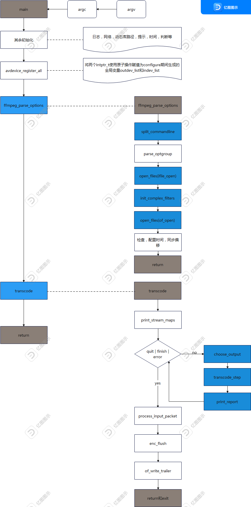

# ffmpeg工具源码学习

## 整体流程

```
 _______              ______________
|       |            |              |
| input |  demuxer   | encoded data |   decoder
| file  | ---------> | packets      | -----+
|_______|            |______________|      |
                                           v
                                       _________
                                      |         |
                                      | decoded |
                                      | frames  |
                                      |_________|
 ________             ______________       |
|        |           |              |      |
| output | <-------- | encoded data | <----+
| file   |   muxer   | packets      |   encoder
|________|           |______________|
```


## ffmpeg 工具

命令为:`ffmpeg [global_options] {[input_file_options] -i input_url} ... {[output_file_options] output_url} ...`

如：`ffmpeg -r 1 -i input.m2v -r 24 output.mp4`


## 函数调用图



如上图，main函数启动，主要是调用了一些函数初始化，以及`avdevice_register_all`,`ffmpeg_parse_options`以及`transcode`等比较重要的函数。

* ffmpeg_parse_options: 进行参数解析，读取文件，判断format，读取一帧获取必要数据等，线程相关等
* transcode： 进行实际转码。


## 源码如下

```
// llw 函数入口
int main(int argc, char **argv)
{
    int ret;
    BenchmarkTimeStamps ti;

    // llw 设置动态库路径
    init_dynload();

    // llw 设置清理回调
    register_exit(ffmpeg_cleanup);

    // llw 设置不缓冲
    setvbuf(stderr,NULL,_IONBF,0); /* win32 runtime needs this */

    av_log_set_flags(AV_LOG_SKIP_REPEATED);
    // llw options是全局并且会被遍历的 会设置一些回调函数 在ffmpeg_opt.c中初始化
    // typedef struct OptionDef {
    //     const char *name;
    //     int flags;
    //     union {
    //         void *dst_ptr;
    //         int (*func_arg)(void *, const char *, const char *);
    //         size_t off;
    //     } u;
    //     const char *help;
    //     const char *argname;
    // } OptionDef;
    parse_loglevel(argc, argv, options);

#if CONFIG_AVDEVICE
    // llw 根据生成代码 进行设备注册
    avdevice_register_all();
#endif
    // llw 初始化socket和openssl的初始化
    avformat_network_init();

    show_banner(argc, argv, options);

    // llw 这个里面做了很多事情 参数解析，打开文件（打开被抽象了很多，URL，file等），探测文件的格式，读取文件头（参数配置等），创建streams等
    /* parse options and open all input/output files */
    ret = ffmpeg_parse_options(argc, argv);
    if (ret < 0)
        exit_program(1);

    // llw 进行文件判断
    if (nb_output_files <= 0 && nb_input_files == 0) {
        show_usage();
        av_log(NULL, AV_LOG_WARNING, "Use -h to get full help or, even better, run 'man %s'\n", program_name);
        exit_program(1);
    }

    // llw  输出文件判断
    /* file converter / grab */
    if (nb_output_files <= 0) {
        av_log(NULL, AV_LOG_FATAL, "At least one output file must be specified\n");
        exit_program(1);
    }

    // llw 开始时间记录
    current_time = ti = get_benchmark_time_stamps();
    // llw 转码 TODO
    ret = transcode();
    if (ret >= 0 && do_benchmark) {
        int64_t utime, stime, rtime;
        current_time = get_benchmark_time_stamps();
        utime = current_time.user_usec - ti.user_usec;
        stime = current_time.sys_usec  - ti.sys_usec;
        rtime = current_time.real_usec - ti.real_usec;
        av_log(NULL, AV_LOG_INFO,
               "bench: utime=%0.3fs stime=%0.3fs rtime=%0.3fs\n",
               utime / 1000000.0, stime / 1000000.0, rtime / 1000000.0);
    }
    av_log(NULL, AV_LOG_DEBUG, "%"PRIu64" frames successfully decoded, %"PRIu64" decoding errors\n",
           decode_error_stat[0], decode_error_stat[1]);
    if ((decode_error_stat[0] + decode_error_stat[1]) * max_error_rate < decode_error_stat[1])
        exit_program(69);

    ret = received_nb_signals ? 255 : ret;
    exit_program(ret);
    return ret;
}

```

之后将对重要函数进行详细分析。